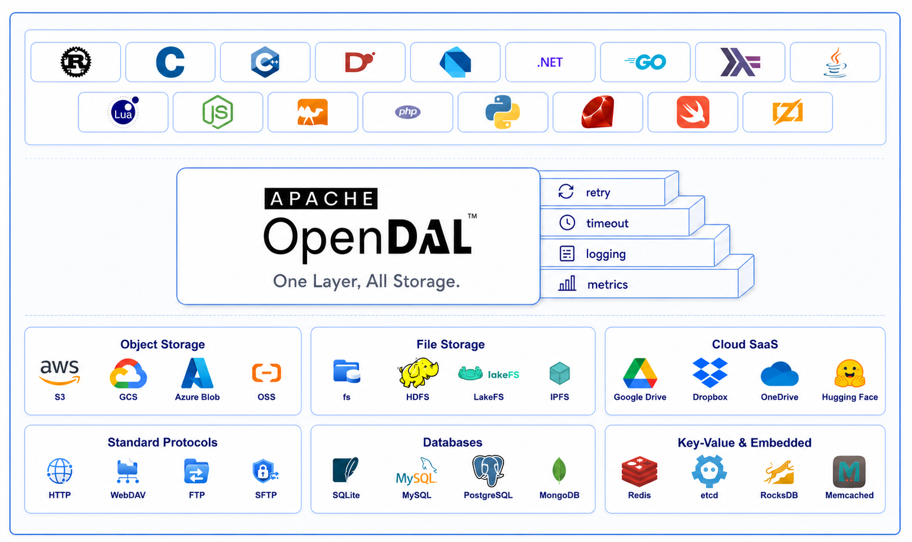
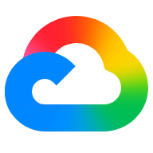
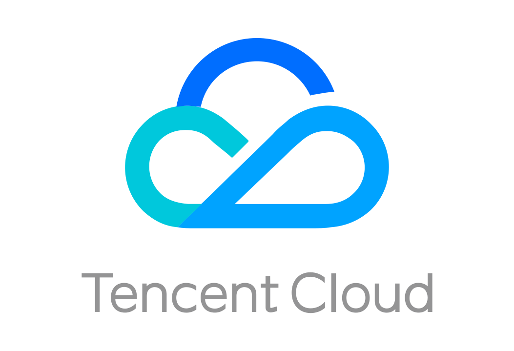
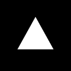

# Apache OpenDAL™: *One Layer, All Storage.*

Apache OpenDAL™ (`/ˈoʊ.pən.dæl/`, pronounced "OH-puhn-dal") is an Open Data Access Layer that gives every language a unified way to access object storage, file storage, cloud SaaS, databases, protocols, and key-value services.

Apache OpenDAL™ is guided by its vision of **One Layer, All Storage** and its core principles: **Open Community**, **Solid Foundation**, **Fast Access**, **Object Storage First**, and **Extensible Architecture**. Read the explained vision at [OpenDAL Vision](https://opendal.apache.org/vision).

## At a Glance

- Project: Apache OpenDAL™
- Vision: **One Layer, All Storage**
- Core package: Rust crate [`opendal`][Rust Core Link]
- Main abstraction: `Operator`
- Extension points: language bindings, layers, and services
- Common layers: retry, timeout, logging, tracing, metrics, throttling, and concurrency control
- Access targets: object storage, file systems, cloud SaaS, databases, protocols, and key-value services

## Why OpenDAL

Apache OpenDAL™ turns the vision of **One Layer, All Storage** into a practical data access layer for applications, libraries, and data systems.

- **Zero-cost core**: built in Rust with composable services and layers, so applications only enable the backends and capabilities they use.
- **Production-ready access**: add retry, timeout, logging, tracing, metrics, throttling, and concurrency limits through reusable layers.
- **One API, all storage**: access object storage, file systems, cloud SaaS, databases, protocols, and key-value services through the same interface.
- **Open and extensible**: add new services, layers, and language bindings while keeping the same unified access model.

## Choose Your Language

Start with the binding for your application runtime. Each binding provides access to the same OpenDAL service model while following its language ecosystem.

> **Note**: Each binding has its own independent version number, which may differ from the Rust core version. When checking for updates or compatibility, always refer to the specific binding's version rather than the core version.

| | | | |
| :---: | :---: | :---: | :---: |
|  **[Rust Core]** [Package][Rust Core Link] · [Docs][Rust Core Release Docs] · [Dev Docs][Rust Core Dev Docs] |  **[C Binding]** [Dev Docs][C Binding Dev Docs] |  **[Cpp Binding]** [Dev Docs][Cpp Binding Dev Docs] |  **[D Binding]** |
|  **[Dart Binding]** |  **[Dotnet Binding]** |  **[Go Binding]** [Package][Go Binding Link] · [Docs][Go Release Docs] |  **[Haskell Binding]** |
|  **[Java Binding]** [Package][Java Binding Link] · [Docs][Java Binding Release Docs] · [Dev Docs][Java Binding Dev Docs] |  **[Lua Binding]** |  **[Node.js Binding]** [Package][Node.js Binding Link] · [Dev Docs][Node.js Binding Dev Docs] |  **[OCaml Binding]** |
|  **[PHP Binding]** |  **[Python Binding]** [Package][Python Binding Link] · [Dev Docs][Python Binding Dev Docs] |  **[Ruby Binding]** [Package][Ruby Binding Link] · [Docs][Ruby Binding Docs] |  **[Swift Binding]** |
|  **[Zig Binding]** |  |  |  |

## Choose Your Layers

Add layers when your application needs cross-service behavior such as retries, timeouts, observability, or traffic control.

| | | | |
| :---: | :---: | :---: | :---: |
|  **[RetryLayer]** Retry temporary failures. |  **[TimeoutLayer]** Bound slow or hanging operations. |  **[LoggingLayer]** Emit structured operation logs. |  **[TracingLayer]** Trace requests across systems. |
|  **[MetricsLayer]** Export operation metrics. |  **[PrometheusLayer]** Expose Prometheus metrics. |  **[OtelMetricsLayer]** Export OpenTelemetry metrics. |  **Traffic Control** [ThrottleLayer] · [ConcurrentLimitLayer] |
|  **[MimeGuessLayer]** Infer `Content-Type` from paths. |  **[RouteLayer]** Route operations by path. |  **[FoyerLayer]** Add hybrid cache behavior. |  **[All Layers][Layers Docs]** Explore the full layer list. |

Explore all available layers in the [layers documentation][Layers Docs].

## Choose Your Services

Pick the storage services that your application needs. See the full OpenDAL service configuration docs in the [services documentation][Services Docs].

<table width="100%">
  <tr>
    <th colspan="3" align="left">Object Storage</th>
    <th colspan="3" align="left">File Storage</th>
  </tr>
  <tr>
    <td width="16.66%"><a href="https://aws.amazon.com/s3/"> s3</a></td>
    <td width="16.66%"><a href="https://cloud.google.com/storage"> gcs</a></td>
    <td width="16.66%"><a href="https://azure.microsoft.com/en-us/services/storage/blobs/"> azblob</a></td>
    <td width="16.66%"><a href="https://opendal.apache.org/docs/rust/opendal/services/struct.Fs.html"> fs</a></td>
    <td width="16.66%"><a href="https://hadoop.apache.org/docs/r3.3.4/hadoop-project-dist/hadoop-hdfs/HdfsDesign.html"> hdfs</a></td>
    <td width="16.66%"><a href="https://github.com/Kimahriman/hdfs-native"> hdfs-native</a></td>
  </tr>
  <tr>
    <td><a href="https://www.aliyun.com/product/oss"> oss</a></td>
    <td><a href="https://www.huaweicloud.com/intl/en-us/product/obs.html"> obs</a></td>
    <td><a href="https://www.tencentcloud.com/products/cos"> cos</a></td>
    <td><a href="https://hadoop.apache.org/docs/stable/hadoop-project-dist/hadoop-hdfs/WebHDFS.html"> webhdfs</a></td>
    <td><a href="https://lakefs.io/"> lakefs</a></td>
    <td><a href="https://ipfs.tech/"> ipfs</a></td>
  </tr>
  <tr>
    <td><a href="https://www.volcengine.com/product/tos"> tos</a></td>
    <td><a href="https://www.backblaze.com/"> b2</a></td>
    <td><a href="https://docs.openstack.org/swift/latest/"> swift</a></td>
    <td><a href="https://docs.ipfs.tech/concepts/file-systems/"> ipmfs</a></td>
    <td><a href="https://learn.microsoft.com/en-us/rest/api/storageservices/file-service-rest-api"> azfile</a></td>
    <td><a href="https://azure.microsoft.com/en-us/products/storage/data-lake-storage/"> azdls</a></td>
  </tr>
  <tr>
    <td><a href="https://www.upyun.com/"> upyun</a></td>
    <td><a href="https://vercel.com/docs/storage/vercel-blob"> vercel-blob</a></td>
    <td></td>
    <td><a href="https://docs.alluxio.io/os/user/stable/en/api/REST-API.html"> alluxio</a></td>
    <td><a href="https://github.com/Tencent/GooseFS"> goosefs</a></td>
    <td><a href="https://docs.databricks.com/en/dbfs/index.html"> dbfs</a></td>
  </tr>
  <tr>
    <td></td>
    <td></td>
    <td></td>
    <td><a href="https://www.mongodb.com/docs/manual/core/gridfs/"> gridfs</a></td>
    <td><a href="https://developer.mozilla.org/en-US/docs/Web/API/File_System_API/Origin_private_file_system"> opfs</a></td>
    <td><a href="https://github.com/bytedance/monoio"> monoiofs</a></td>
  </tr>
  <tr>
    <td></td>
    <td></td>
    <td></td>
    <td><a href="https://github.com/compio-rs/compio/"> compfs</a></td>
    <td></td>
    <td></td>
  </tr>
  <tr>
    <th colspan="3" align="left">Cloud SaaS</th>
    <th colspan="3" align="left">Standard Protocols</th>
  </tr>
  <tr>
    <td><a href="https://www.google.com/drive/"> gdrive</a></td>
    <td><a href="https://www.dropbox.com/"> dropbox</a></td>
    <td><a href="https://www.microsoft.com/en-us/microsoft-365/onedrive/online-cloud-storage"> onedrive</a></td>
    <td><a href="https://developer.mozilla.org/en-US/docs/Web/HTTP"> http</a></td>
    <td><a href="https://datatracker.ietf.org/doc/html/rfc959"> ftp</a></td>
    <td><a href="https://datatracker.ietf.org/doc/html/rfc4918"> webdav</a></td>
  </tr>
  <tr>
    <td><a href="https://www.aliyundrive.com/"> aliyun-drive</a></td>
    <td><a href="https://huggingface.co/"> hf</a></td>
    <td><a href="https://github.com/"> github</a></td>
    <td><a href="https://datatracker.ietf.org/doc/html/draft-ietf-secsh-filexfer-02"> sftp</a></td>
    <td></td>
    <td></td>
  </tr>
  <tr>
    <td><a href="https://www.pcloud.com/"> pcloud</a></td>
    <td><a href="https://koofr.eu/"> koofr</a></td>
    <td><a href="https://www.seafile.com/"> seafile</a></td>
    <td></td>
    <td></td>
    <td></td>
  </tr>
  <tr>
    <td><a href="https://360.yandex.com/disk/"> yandex-disk</a></td>
    <td></td>
    <td></td>
    <td></td>
    <td></td>
    <td></td>
  </tr>
  <tr>
    <th colspan="3" align="left">Databases</th>
    <th colspan="3" align="left">Key-Value &amp; Embedded</th>
  </tr>
  <tr>
    <td><a href="https://www.sqlite.org/"> sqlite</a></td>
    <td><a href="https://www.mysql.com/"> mysql</a></td>
    <td><a href="https://www.postgresql.org/"> postgresql</a></td>
    <td> memory</td>
    <td><a href="https://redis.io/"> redis</a></td>
    <td><a href="https://etcd.io/"> etcd</a></td>
  </tr>
  <tr>
    <td><a href="https://www.mongodb.com/"> mongodb</a></td>
    <td><a href="https://surrealdb.com/"> surrealdb</a></td>
    <td><a href="https://developers.cloudflare.com/d1/"> d1</a></td>
    <td><a href="http://rocksdb.org/"> rocksdb</a></td>
    <td><a href="https://memcached.org/"> memcached</a></td>
    <td><a href="https://developers.cloudflare.com/kv/">cloudflare-kv</a></td>
  </tr>
  <tr>
    <td></td>
    <td></td>
    <td></td>
    <td><a href="https://tikv.org/"> tikv</a></td>
    <td><a href="https://www.foundationdb.org/"> foundationdb</a></td>
    <td><a href="https://crates.io/crates/sled"> sled</a></td>
  </tr>
  <tr>
    <td></td>
    <td></td>
    <td></td>
    <td><a href="https://crates.io/crates/redb"> redb</a></td>
    <td><a href="https://crates.io/crates/persy"> persy</a></td>
    <td><a href="https://github.com/xacrimon/dashmap"> dashmap</a></td>
  </tr>
  <tr>
    <td></td>
    <td></td>
    <td></td>
    <td><a href="https://crates.io/crates/cacache"> cacache</a></td>
    <td><a href="https://github.com/moka-rs/moka"> moka</a></td>
    <td><a href="https://github.com/moka-rs/mini-moka"> mini-moka</a></td>
  </tr>
  <tr>
    <td></td>
    <td></td>
    <td></td>
    <td><a href="https://github.com/foyer-rs/foyer"> foyer</a></td>
    <td><a href="https://docs.github.com/en/actions/using-workflows/caching-dependencies-to-speed-up-workflows"> ghac</a></td>
    <td><a href="https://vercel.com/docs/concepts/monorepos/remote-caching">vercel-artifacts</a></td>
  </tr>
</table>

## Examples

See [examples](./examples/) for runnable usage examples.

## Documentation

- Website: <https://opendal.apache.org>
- Vision: <https://opendal.apache.org/vision>
- Rust release docs: <https://docs.rs/opendal>
- Rust dev docs: <https://opendal.apache.org/docs/rust/opendal/>

## Contribute

OpenDAL is an active open-source project. We are always open to people who want to use it or contribute to it. Here are some ways to go.

- Start with [Contributing Guide](CONTRIBUTING.md).
- Submit [Issues](https://github.com/apache/opendal/issues/new) for bug report or feature requests.
- Start [Discussions](https://github.com/apache/opendal/discussions/new?category=q-a) for questions or ideas.
- Talk to community directly at [Discord](https://opendal.apache.org/discord).
- Report security vulnerabilities to [private mailing list](mailto:private@opendal.apache.org)

## Branding

The first and most prominent mentions must use the full form: **Apache OpenDAL™** of the name for any individual usage (webpage, handout, slides, etc.) Depending on the context and writing style, you should use the full form of the name sufficiently often to ensure that readers clearly understand the association of both the OpenDAL project and the OpenDAL software product to the ASF as the parent organization.

For more details, see the [Apache Product Name Usage Guide](https://www.apache.org/foundation/marks/guide).

## License and Trademarks

Licensed under the Apache License, Version 2.0: <http://www.apache.org/licenses/LICENSE-2.0>

Apache OpenDAL, OpenDAL, and Apache are either registered trademarks or trademarks of the Apache Software Foundation.

<!-- Link references -->

<!-- Binding references -->

[Rust Core]: core/README.md
[Rust Core Link]: https://crates.io/crates/opendal
[Rust Core Release Docs]: https://docs.rs/opendal
[Rust Core Dev Docs]: https://opendal.apache.org/docs/rust/opendal/
[C Binding]: bindings/c/README.md
[C Binding Dev Docs]: https://opendal.apache.org/docs/c/
[Cpp Binding]: bindings/cpp/README.md
[Cpp Binding Dev Docs]: https://opendal.apache.org/docs/cpp/
[D Binding]: bindings/d/README.md
[Dart Binding]: bindings/dart/README.md
[Dotnet Binding]: bindings/dotnet/README.md
[Go Binding]: bindings/go/README.md
[Go Binding Link]: https://pkg.go.dev/github.com/apache/opendal/bindings/go
[Go Release Docs]: https://pkg.go.dev/github.com/apache/opendal/bindings/go
[Haskell Binding]: bindings/haskell/README.md
[Java Binding]: bindings/java/README.md
[Java Binding Link]: https://central.sonatype.com/artifact/org.apache.opendal/opendal-java
[Java Binding Release Docs]: https://javadoc.io/doc/org.apache.opendal/opendal-java
[Java Binding Dev Docs]: https://opendal.apache.org/docs/java/
[Lua Binding]: bindings/lua/README.md
[Node.js Binding]: bindings/nodejs/README.md
[Node.js Binding Link]: https://www.npmjs.com/package/opendal
[Node.js Binding Dev Docs]: https://opendal.apache.org/docs/nodejs/
[OCaml Binding]: bindings/ocaml/README.md
[PHP Binding]: bindings/php/README.md
[Python Binding]: bindings/python/README.md
[Python Binding Link]: https://pypi.org/project/opendal/
[Python Binding Dev Docs]: https://opendal.apache.org/docs/python/
[Ruby Binding]: bindings/ruby/README.md
[Ruby Binding Link]: https://rubygems.org/gems/opendal
[Ruby Binding Docs]: https://opendal.apache.org/docs/ruby/
[Swift Binding]: bindings/swift/README.md
[Zig Binding]: bindings/zig/README.md

<!-- Layer references -->

[Layers Docs]: https://opendal.apache.org/docs/rust/opendal/layers/
[RetryLayer]: https://opendal.apache.org/docs/rust/opendal/layers/struct.RetryLayer.html
[TimeoutLayer]: https://opendal.apache.org/docs/rust/opendal/layers/struct.TimeoutLayer.html
[LoggingLayer]: https://opendal.apache.org/docs/rust/opendal/layers/struct.LoggingLayer.html
[TracingLayer]: https://opendal.apache.org/docs/rust/opendal/layers/struct.TracingLayer.html
[MetricsLayer]: https://opendal.apache.org/docs/rust/opendal/layers/struct.MetricsLayer.html
[PrometheusLayer]: https://opendal.apache.org/docs/rust/opendal/layers/struct.PrometheusLayer.html
[OtelMetricsLayer]: https://opendal.apache.org/docs/rust/opendal/layers/struct.OtelMetricsLayer.html
[ThrottleLayer]: https://opendal.apache.org/docs/rust/opendal/layers/struct.ThrottleLayer.html
[ConcurrentLimitLayer]: https://opendal.apache.org/docs/rust/opendal/layers/struct.ConcurrentLimitLayer.html
[MimeGuessLayer]: https://opendal.apache.org/docs/rust/opendal/layers/struct.MimeGuessLayer.html
[RouteLayer]: https://opendal.apache.org/docs/rust/opendal/layers/struct.RouteLayer.html
[FoyerLayer]: https://opendal.apache.org/docs/rust/opendal/layers/struct.FoyerLayer.html

<!-- Service references -->

[Services Docs]: https://opendal.apache.org/docs/rust/opendal/services/
