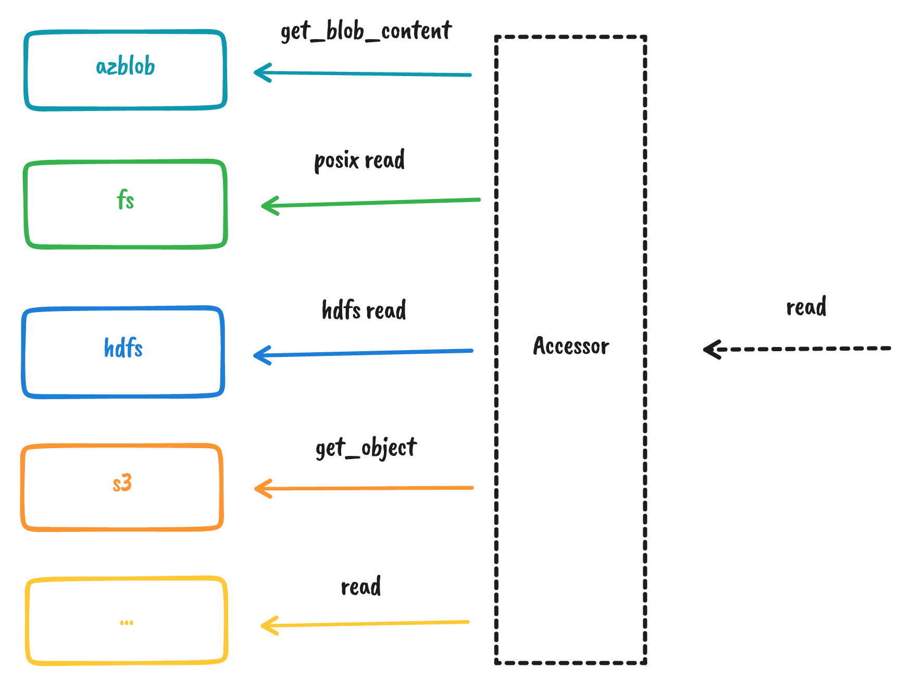
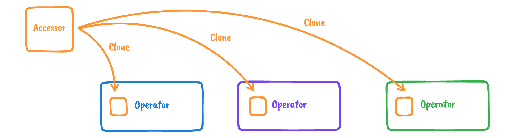
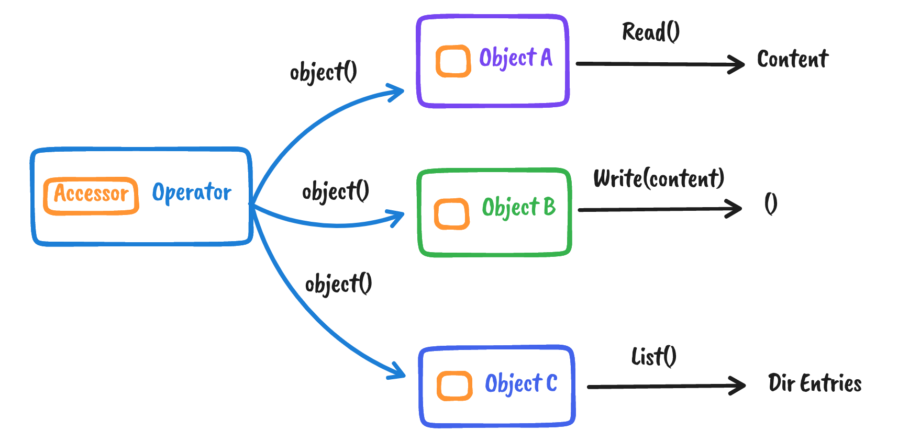

# Concepts

OpenDAL provides a unified abstraction for all storage services.

## Accessor

First, let's start with [`Accessor`]. [`Accessor`] is the underlying trait that communicate with different storage backends. We use `Accessor` to abstract the same operations sets on different backends.

## Operator

To make our users life easier, we build a struct [`Operator`] which can be used anyway.

[`Operator`] itself is a simple wrapper of [`Accessor`] and is very cheap to be cloned. We build our public APIs upon [`Operator`] instead.

## Object

[`Object`] is the smallest unit in OpenDAL which could be a `File Object`, `Dir Object` or others. [`Object`] is constructed via [`Operator::object()`].

It's a bit like `File` and `Handle` in Rust, but we don't need to `open` or `close` them. Every API is very straight:

For detailed APIs, please refer to [API Documents](/opendal)

[`Accessor`]: https://docs.rs/opendal/latest/opendal/raw/trait.Accessor.html
[`Operator`]: https://docs.rs/opendal/latest/opendal/struct.Operator.html
[`Object`]: https://docs.rs/opendal/latest/opendal/struct.Object.html
[`Operator::object()`]: https://docs.rs/opendal/latest/opendal/struct.Operator.html#method.object
