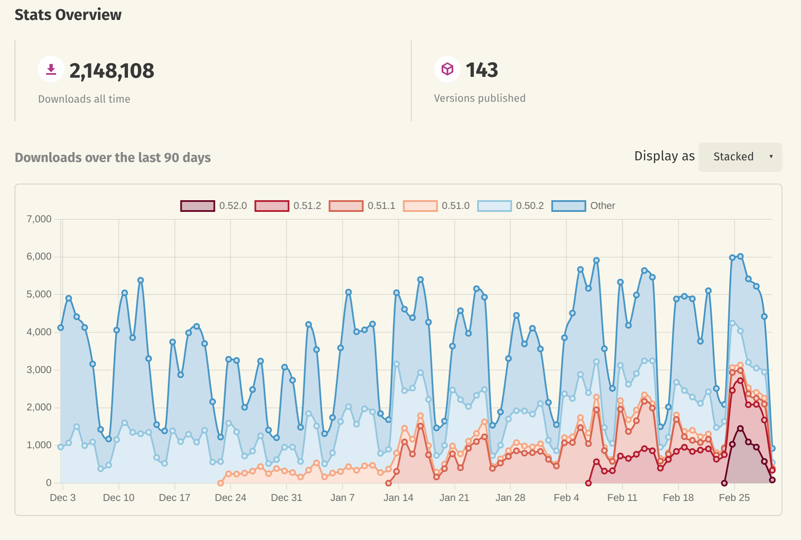
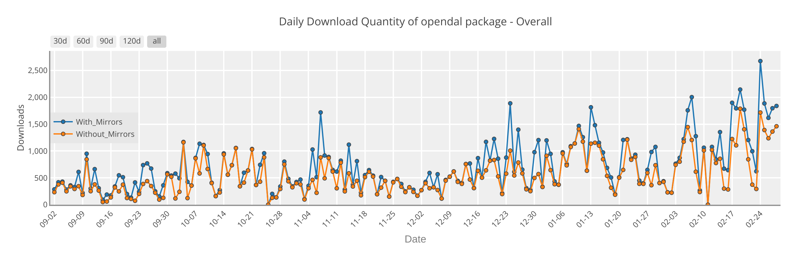
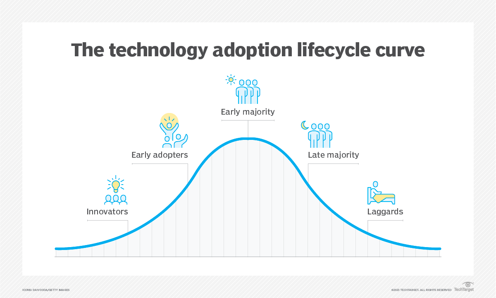

Hi everyone, long time no see. Although we have been actively developing OpenDAL and consistently releasing updates, we haven’t provided a clear overview of where OpenDAL is heading. This post aims to address that. Here, we will discuss OpenDAL's current position and the future directions we are moving toward.

I hope this post serves as a guide for our development, encourages more people to contribute, and ultimately helps achieve the vision of OpenDAL.

<!--truncate-->

## What's OpenDAL?

Apache OpenDAL (`/ˈoʊ.pən.dæl/`, pronounced "OH-puhn-dal") is an Open Data Access Layer that enables seamless interaction with diverse storage services. Our VISION is [**One Layer, All Storage**](https://opendal.apache.org/vision), and our core principles are Open Community, Solid Foundation, Fast Access, Object Storage First, and Extensible Architecture.

We are building:

- [A core library built in Rust](https://crates.io/crates/opendal) that supports all services at zero cost and offers unified retry, concurrency, logging, tracing, metrics, timeout and more layers.
- Language bindings for [Python](https://pypi.org/project/opendal/), [Java](https://central.sonatype.com/artifact/org.apache.opendal/opendal), [Node.js](https://www.npmjs.com/package/opendal), C/C++, and more.
- Integrations with various frameworks, including [Parquet](https://crates.io/crates/parquet-opendal), [FUSE](https://crates.io/crates/fuse3_opendal), [DAV server](https://github.com/messense/dav-server-rs), and others.
- Binaries for different use cases, such as [CLI](https://crates.io/crates/oli) and [FUSE](https://crates.io/crates/ofs).

In short, through OpenDAL, users can access ALL storage services within ONE layer.

## Where's OpenDAL?

OpenDAL's rust core has already released 143 versions, has [67 reverse dependencies](https://crates.io/crates/opendal/reverse_dependencies) listed on [crates.io](http://crates.io/), and is used by [612 projects](https://github.com/apache/opendal/network/dependents) as recorded on GitHub.

OpenDAL's production users include databases such as [Databend](https://github.com/databendlabs/databend), [GreptimeDB](https://github.com/GreptimeTeam/greptimedb), and [RisingWave](https://github.com/risingwavelabs/risingwave), as well as tools like [Loco](https://loco.rs/), [sccache](https://github.com/mozilla/sccache), and [Vector](https://vector.dev/).

Apart from OpenDAL's Rust core, its various language bindings have also seen significant growth over the past year. Take python binding as an example. [Dify](https://github.com/langgenius/dify/), an LLM app development platform, is using OpenDAL to access different storage services.

## What's next for OpenDAL?

The following is the famous technology adoption lifecycle curve. If I were to indicate the position of OpenDAL, I would say it is at the end of the Innovators stage and moving toward the Early Adopters stage.

(picture from TechTarget [technology adoption lifecycle](https://www.techtarget.com/searchcio/definition/technology-adoption-lifecycle))

Innovators are adopting OpenDAL. Projects like Databend, RisingWave, GreptimeDB, and sccache have been using OpenDAL in production for years. However, early adopters are still hesitant to use OpenDAL—and they have valid reasons.

For examples:

- OpenDAL hasn't reached version 1.0 yet and still introduces breaking changes from time to time, sometimes even requiring code modifications for an OpenDAL upgrade. This also creates a burden for libraries that depend on OpenDAL, as every breaking change affects them as well.
- OpenDAL lacks comprehensive documentation, particularly for its bindings in Python and Java. Users need to invest significant effort and love to integrate OpenDAL bindings into their projects.
- OpenDAL lacks some important features, such as checksum support, caching, metrics of underlying http requests and initialization from a URI.

I believe we should perfect production adoption in 2025 to get OpenDAL ready for early adopters. Only in this way can we implement our vision: **One Layer, All Storage.**

## What to do in 2025?

Our plans for 2025 include the following:

### Features Needed in Production

In 2025, we plan to implement the following features that are importmant for production adoption:

- [Context](https://github.com/apache/opendal/issues/5480): Introduce context in OpenDAL so that services and layers can share the same context. This enables users to gain deeper insights into OpenDAL's internal operations by incorporating metrics, logging, and tracing into the underlying HTTP client we use.
- [Versioning](https://github.com/apache/opendal/issues/2611): Introduce full file versioning support in OpenDAL, enabling users to read, write, delete, list, and restore versioned files. This functionality will allow users to recover mistakenly deleted files and facilitate disaster recovery.
- [Checksum](https://github.com/apache/opendal/issues/5549): Introduce end-to-end checksum support in OpenDAL, enabling users to perform checksums during reading and writing without worrying about bit flips in memory or over the network.
- [Caching](https://github.com/apache/opendal/issues/5678): Provide high-quality built-in cache support in OpenDAL while ensuring users have the flexibility to implement their own caching logic.
- [Initialization From URI](https://github.com/apache/opendal/issues/3022): Allow users to initialize OpenDAL from a URI string, making it easier to configure and use OpenDAL in various environments.

### Improvements Needed for Production

In 2025, we plan to improve the following aspects of OpenDAL to ensure users can confidently use it in production.

- Documentation: Improve the documentation for OpenDAL, particularly for bindings like Python, Node.js, and Java. The first step is to generate well-structured documentation for the configuration values of each service.
- Communitation: Bring Back Our Community Meetings. OpenDAL used to hold regular tri-weekly meetings, but we have been unable to maintain them in the last year. We now plan to revive these meetings and encourage more face-to-face discussions in the coming years.

## Conclusion

2025 marks the third year of the OpenDAL community. A huge thanks to all OpenDAL contributors and users for helping us reach this milestone. There's still a long way to go to achieve our vision, and we invite you all to join us on this incredible journey!

[Discuss about this post here](https://github.com/apache/opendal/discussions/5679)
