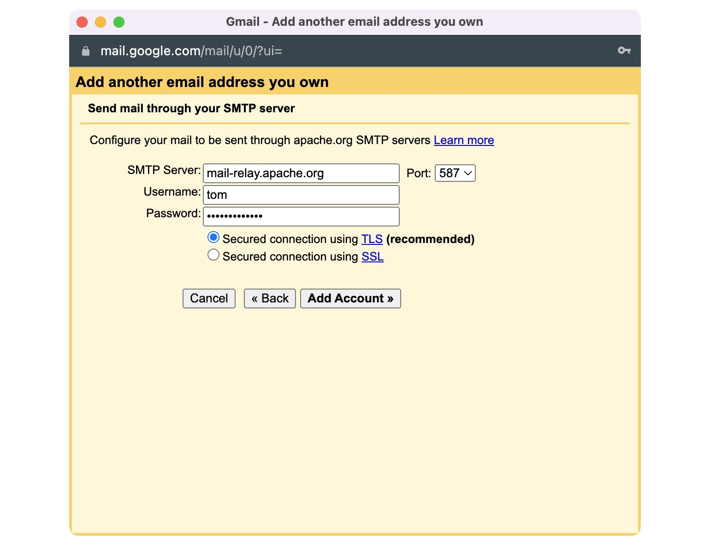

This document mainly aims to provide guidance for new committers to OpenDAL.

When a new committer receives an invitation email from OpenDAL's PPMC, they should consider whether to accept. If they choose to accept, please select Reply All and express your willingness to become a commmitter for OpenDAL.

## Submit CLA

1. Download the ICLA from https://www.apache.org/licenses/contributor-agreements.html#clas. If a corporation assigns employees to work on an Apache project, please download the CCLA.
2. Fill out the ICLA according to your personal situation. Please note:
    - The address field should be filled out accurately and in detail.
    - You need to choose a unique ApacheID that hasn't been taken. Check https://people.apache.org/committer-index.html to see which IDs are still available.
3. Sign document by hand or by electronic signature
    - Sign the document by hand-writing your signature on a printed copy and scan as a pdf.
    - Digitally draw a signature on the document: [Detail Instruction](https://www.apache.org/licenses/cla-faq.html#printer)
    - Sign the document via PGP: [Detail Instruction](https://www.apache.org/licenses/contributor-agreements.html#submitting)
4. Send your icla.pdf and icla.pdf.asc (if signed with PGP) to [secretary@apache.org](mailto:secretary@apache.org).

After waiting for some time, you will receive an email notifying you that your CLA has been successfully recorded.

## Setup ASF Account

When receive an email with the subject "Welcome to the Apache Software Foundation" from root@apache.org, we can begin setting up ASF account.

### Setup LDAP Password

1. Go to https://id.apache.org/reset/enter and enter your ApacheID
2. Check your email and click the link to reset your password

### Link ASF Account to GitHub

1. Go to https://gitbox.apache.org/boxer/ and enter your ApacheID and password
2. Click "Authenticate with GitHub" and follow the instructions to link your ASF account to GitHub
3. Check your email titled "[GitHub] @asfgit has invited you to join the @apache organization" and accept the invitation
4. Wait for a while and the website will automatically update
5. (If you not enable 2FA on GitHub) Please follow the [instruction](https://docs.github.com/en/authentication/securing-your-account-with-two-factor-authentication-2fa/configuring-two-factor-authentication)

You will see your both apacheID and GitHub ID show up on https://gitbox.apache.org/boxer/
Congratulations! You have successfully linked your ASF account to GitHub.

## Email Settings

Apache does not provide a mailbox directly.

### Receive Email

You can change your forwarding email address at [Apache Account Utility Platform](https://id.apache.org/)

### Send Email 

If you want to send email from your apache.org email address, you need to configure your email client to use the `mail-relay` service. Please refer to [this page](https://infra.apache.org/committer-email.html) for more details.

I will provide an example for Gmail users.

1. Go to your Gmail settings and click "See all settings"
2. Click "Accounts and Import" and find "Send mail as"
3. Click "Add another email address" and enter your name and apache.org email address
4. Input the SMTP server information:
    - SMTP Server: mail-relay.apache.org
    - Port: 587
    - Username: your apacheID
    - Password: your apacheID password
    - Secured connection using TLS
5. Click "Add account" and you will receive an email from Gmail

### Subscribe Mailing List

1. Send email to [dev-subscribe@opendal.apache.org](mailto:dev-subscribe@opendal.apache.org)
2. You will receive an email with the subject "confirm subscribe to dev@opendal.apache.org"
3. Reply to the email with "Confirm" in the body

If you receive an email with the subject "WELCOME to dev@opendal.apache.org", you have successfully subscribed to the mailing list.

## Setup 1password
@TODO
